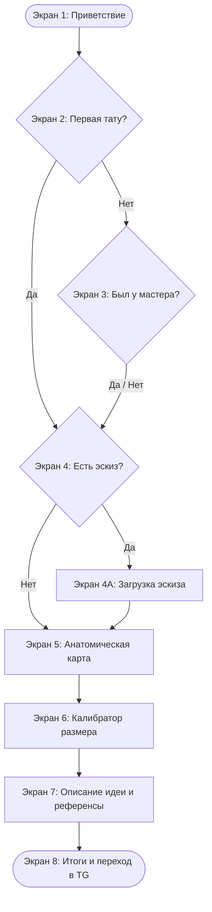
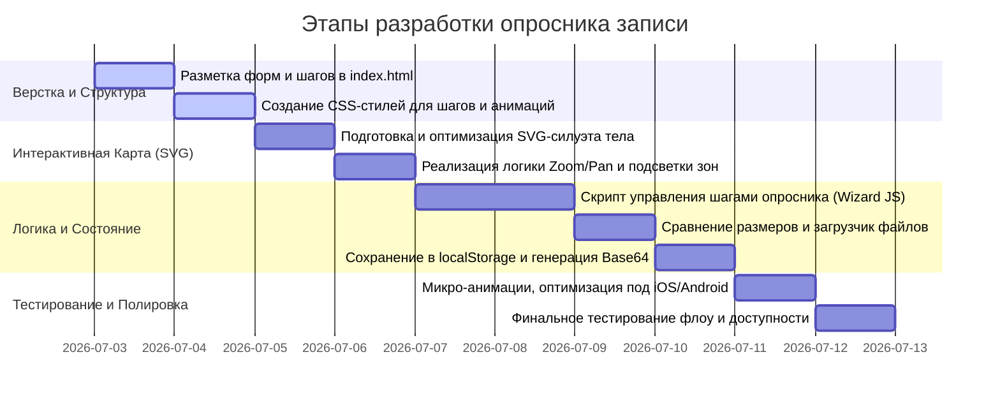

# Интерактивный опросник для записи на консультацию — Black Carp

Этот документ содержит детальное проектирование интерактивного опросника для вкладки «Запись» (booking view) на сайте тату-мастера Black Carp.

---

## 1. Концепция и UX-архитектура

Главная цель опросника — превратить банальное заполнение формы в эстетичный, вовлекающий и тактильный процесс. Он должен соответствовать общей атмосфере сайта: сдержанности, минимализму, высокому уровню сервиса и художественному подходу.

### Что было доработано (чего не было в исходном запросе):
1. **Двусторонняя анатомическая карта (Front/Back)**: Возможность переключения вида человека (вид спереди / вид сзади), так как многие татуировки делаются на лопатках, икрах сзади или пояснице.
2. **Комбинированный выбор (SVG + Кнопки)**: На мобильном экране кликнуть по мелкой части тела (например, запястье или шея) пальцем крайне сложно. При приближении к части тела, помимо зума SVG, появляется текстовый список крупных и удобных кнопок для выбора конкретной зоны.
3. **Визуальный калибратор размера**: Вместо сухих сантиметров пользователь видит сравнение с бытовыми предметами (спичечный коробок, смартфон, лист А5, лист А4) с графической визуализацией пропорций.
4. **Контекстный мудборд (Инспирация)**: Если у клиента нет эскиза, после выбора части тела сайт показывает мини-галерею работ мастера, выполненных именно на этой части тела (например, если выбрано предплечье — показываются 2–3 работы на предплечье). Это вдохновляет и направляет клиента.
5. **Автосохранение (localStorage)**: Если пользователь случайно закроет вкладку или перезагрузит страницу, его прогресс сохранится, и он сможет продолжить с того же места.
6. **Двойной механизм передачи данных в Telegram**:
   - *Для подготовленных ботов*: Генерация Base64-строки с ответами для передачи в параметре deep-link (`t.me/blackcarp_bot?start=base64_data`). При старте бота мастер сразу видит структурированную карточку клиента.
   - *Резервный*: Автоматическое копирование красивого текстового резюме в буфер обмена с уведомлением («Ваша анкета скопирована. Просто вставьте её в диалог с мастером»).

---

## 2. Пошаговый сценарий опросника (User Flow)

---

### Экран 1: Приветствие (Welcome Screen)
- **Визуал**: Минималистичный экран. Фоновый полупрозрачный силуэт логотипа или абстрактной геометрии.
- **Текст**: 
  - Заголовок: `DESIGNING YOUR TATTOO` (Serif Display)
  - Подзаголовок: `Интерактивная анкета перед консультацией` (Sans)
  - Описание: «Мастер создаёт эскизы индивидуально под анатомию вашего тела. Ответы на эти вопросы помогут нам точнее обсудить будущий проект.»
- **Кнопка**: `Начать опрос` (Milk-white cta).

### Экран 2: Опыт (First Tattoo)
- **Вопрос**: `Это ваша первая татуировка?`
- **Варианты**:
  - `Да, это мой первый сеанс`
  - `Нет, на моем теле уже есть татуировки`
- **Анимация**: Карточки вариантов при наведении мягко подсвечиваются рамкой, при клике — плавно сдвигаются влево, уступая место следующему вопросу.

### Экран 3: Знакомство с мастером (только если «Нет» на Экране 2)
- **Вопрос**: `Вы уже делали татуировки у Black Carp?`
- **Варианты**:
  - `Да, мы уже работали вместе`
  - `Нет, это будет первый проект с этим мастером`

### Экран 4: Наличие эскиза (Sketch Presence)
- **Вопрос**: `У вас есть готовый эскиз?`
- **Варианты**:
  - `Да, есть эскиз или точный рисунок` --> Переход на **Экран 4A (Загрузка)**
  - `Нет, нужна индивидуальная разработка` --> Переход на **Экран 5 (Карта тела)**

#### Экран 4A: Загрузка эскиза (Sketch Upload)
- **Действие**: Перетаскивание (Drag & Drop) или клик для выбора файла.
- **Визуал**: Тонкая штриховая рамка цвета `rgba(238, 230, 214, 0.18)`. При перетаскивании рамка становится сплошной.
- **Превью**: После выбора файла показывается его миниатюра с кнопкой удаления «×».
- **Кнопка**: `Продолжить` (активируется после загрузки или позволяет пропустить, если передумали).

---

### Экран 5: Интерактивная анатомическая карта (Body Map)

Самый технологичный и визуально эффектный шаг.

#### Интерфейс:
1. **Переключатель ракурса**: Две аккуратные вкладки: `Спереди` / `Сзади` (Front / Back). При переключении 3D-подобный силуэт человека плавно разворачивается (CSS-эффект перехода `opacity` + `transform: rotateY(180deg)`).
2. **Интерактивный SVG-силуэт**:
   - Выполнен в виде чистых минималистичных линий цвета `--faint`.
   - Разделен на 5 основных зон взаимодействия: **Голова/Шея, Торс, Спина, Руки, Ноги**.
   - При наведении курсора на зону, она подсвечивается мягким внутренним свечением.
3. **Механика зума (Zoom & Choice) в сплит-экране**:
   - При клике на зону силуэт человека плавно сдвигается влево, занимая 40% ширины контейнера (`flex-basis: 40%`), а SVG плавно масштабируется (`transform: scale(...) translate(...)`) и фокусируется на выбранной зоне.
   - Справа освобождается 60% ширины, куда плавно выезжает панель выбора подзон с кнопками.
   - Это гарантирует, что силуэт с зумом остается видимым параллельно со списком кнопок, визуализируя выбор пользователя в реальном времени.
   - Список подзон:
     - **Руки**: `Плечо`, `Предплечье`, `Бицепс`, `Запястье/Кисть`, `Рукав целиком`.
     - **Ноги**: `Бедро`, `Голень / Икра`, `Колено`, `Лодыжка / Стопа`, `Штанина целиком`.
     - **Торс**: `Грудь`, `Ключица`, `Ребра`, `Живот`.
     - **Спина**: `Верх спины / Лопатки`, `Поясница`, `Вдоль позвоночника`, `Вся спина`.
     - **Голова/Шея**: `Шея сбоку/сзади`, `За ухом`, `Голова / Лицо`.
4. **Кнопка возврата**: Кнопка `← К силуэту` плавно сбрасывает масштаб SVG до 1:1, убирает класс `.zone-selected` с контейнера и возвращает силуэт в центр на 100% ширины, скрывая список подзон.

---

### Экран 6: Калибратор размера (Size Selector)

Клиентам сложно ориентироваться в сантиметрах. Мы предлагаем визуальное сравнение.

- **Вопрос**: `Какого размера планируется татуировка?`
- **Интерфейс**:
  - **Сетка карточек с пресетами**:
    - **XS (до 5х5 см)**: «Размер спичечного коробка. Для небольших символов, тонких линий или минимализма».
    - **S (до 10х10 см)**: «Размер банковской карты. Оптимально для небольших графических элементов».
    - **M (до 15х15 см)**: «Размер смартфона. Позволяет передать хорошую детализацию в графике».
    - **L (до 20х20 см)**: «Формат А5 (половина листа). Подходит для средних проектов на плече, бедре или икре».
    - **XL (более 25х25 см)**: «Формат А4 и крупнее. Масштабные проекты: рукава, спины, торс».
  - **Интерактивный визуал**: При выборе карточки сбоку/снизу рендерится рамка выбранного формата (например, пропорция А5) рядом со схематичным силуэтом смартфона/карты для наглядного сопоставления.
  - **Поле ручного ввода**: Ползунок (range slider) от 5 до 40 см: «Ориентировочная длина по большей стороне: **X см**».

---

### Экран 7: Описание идеи и референсы (Idea Details)
- **Поле ввода**: Текстовое поле с автовысотой (textarea) для свободного описания идеи: «Опишите, что бы вы хотели видеть на татуировке (сюжет, элементы, настроение, важные детали)».
- **Загрузка референсов**: Возможность прикрепить до 3 изображений (фотографии заживших работ мастера, примеры стилистики, картины или фотографии объектов природы).

---

### Экран 8: Финал и отправка (Confirmation & Telegram Link)
- **Резюме анкеты**: Красиво оформленная карточка с выбранными параметрами (Эскиз: Да/Нет, Зона: Предплечье, Размер: М, Описание: «...»).
- **Ориентировочная стоимость**: Динамическая плашка на основе размера и зоны (например, «Базовая стоимость для данного масштаба: от 12 000 ₽. Итоговая цена фиксируется после обсуждения эскиза»).
- **Основное действие**: Кнопка `Отправить заявку в Telegram` (Milk-white cta).
- **Сценарий клика**:
  1. Данные сохраняются в `localStorage` (для отображения статуса в Профиле).
  2. Генерируется текст сообщения.
  3. Текст автоматически копируется в буфер обмена.
  4. Показывается красивое микро-уведомление (toast): *«Анкета скопирована в буфер обмена. Бот откроется через секунду — просто вставьте текст в чат!»*.
  5. Происходит переход по ссылке `t.me/blackcarp_bot?start=base64_hash`.

---

## 3. План реализации по шагам

### Шаг 1: Разметка и стили
- Интегрировать контейнер опросника `#booking-wizard` в `view-booking` в `index.html`.
- Сверстать шаги как отдельные слайды со свойством `display: none` (активный шаг получает класс `.step--active`).
- Добавить прогресс-бар (`.wizard-progress-bar`) в верхней части формы.

### Шаг 2: Реализация интерактивного тела (SVG)
- Создать встроенный (inline) SVG силуэта человека (спереди/сзади).
- Навесить классы и `data-zone` на элементы SVG (`path` или `g`).
- Написать CSS-переходы для зума. При добавлении класса `.zoomed-[zone]` к контейнеру SVG, применять нужные `transform: scale() translate()`.

### Шаг 3: JavaScript-медиатор (Состояние)
- Написать менеджер состояния опросника в `script.js` (объект `wizardState`, хранящий ответы).
- Реализовать валидацию шагов (например, кнопка «Далее» не активна на шаге загрузки, пока не загружен файл, или если он не пропущен).
- Реализовать сохранение состояния в `localStorage`.

### Шаг 4: Интеграция с ботом
- Функция `compileSummaryText(state)`: собирает красивый текстовый отчет на русском языке.
- Функция `encodeStateToBase64(state)`: кодирует JSON-объект в safe Base64 для передачи через query-параметр.
- Привязка обработчика к финальной кнопке отправки.

### Шаг 5: Полировка интерфейса
- Тестирование кликов на мобильных устройствах, проверка высоты областей ввода (чтобы клавиатура не перекрывала кнопки «Далее»).
- Добавление плавных переходов с помощью View Transitions API для современных браузеров и CSS-анимаций для более старых.
