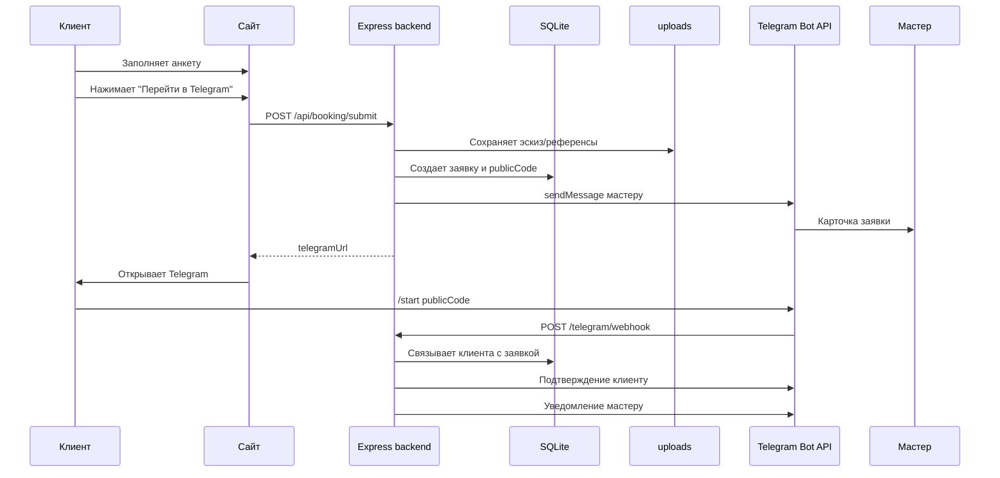

# Black Carp — Telegram-бот и заявка на своем сервере

## Цель

Клиент заполняет анкету на сайте. При клике `Перейти в Telegram` сайт отправляет заявку на backend. Backend сохраняет заявку и вложения, сразу отправляет мастеру карточку в Telegram и возвращает deep link в бота.

Telegram ID клиента появляется только после `/start <code>`, поэтому мастер видит заявку до первого сообщения клиента, но бот связывает клиента с заявкой уже после открытия Telegram.

## Стек

| Слой | Решение |
|---|---|
| Сайт | текущий HTML/CSS/JS |
| Backend | Node.js + Express |
| БД | SQLite-файл `data/black-carp.sqlite` |
| Файлы | локальная папка `uploads/booking/` |
| Telegram | Bot API webhook |
| Запуск | `npm start`, дальше pm2/systemd |

Для текущего объема этого достаточно. Если позже появятся CRM, несколько мастеров, календарь и платежи, SQLite можно заменить на PostgreSQL.

## Поток



## База данных

Сервер сам создает схему при старте.

Основные таблицы:

- `clients` — Telegram-профиль клиента;
- `booking_requests` — анкета и статус заявки;
- `booking_attachments` — ссылки на локальные файлы;
- `status_history` — история статусов;
- `telegram_updates` — защита от повторной обработки webhook.

Ключевые статусы:

| Статус | Значение |
|---|---|
| `submitted` | анкета сохранена |
| `awaiting_client_start` | мастер уведомлен, клиент еще не нажал Start |
| `master_notify_failed` | заявка сохранена, уведомление мастеру не ушло |
| `client_linked` | клиент открыл бота и связан с заявкой |
| `in_review` | мастер взял заявку |
| `need_details` | нужны уточнения |
| `consultation_offered` | предложена консультация |
| `closed` | закрыто |
| `spam` | спам |

## API

### `POST /api/booking/submit`

Принимает анкету с сайта.

Делает:

1. Проверяет payload.
2. Сохраняет вложения в `uploads/booking/<requestId>/`.
3. Создает заявку в SQLite.
4. Отправляет карточку мастеру в Telegram.
5. Возвращает `telegramUrl`.

### `POST /telegram/webhook`

Принимает события Telegram.

Обрабатывает:

- `/start <code>`;
- inline-кнопки мастера;
- повторные `update_id`.

### `GET /api/booking/status/:publicCode`

Возвращает безопасный статус заявки для сайта.

## Что видит клиент

На сайте:

- анкету;
- итоговое резюме;
- ориентировочную стоимость;
- согласие на отправку данных;
- кнопку `Перейти в Telegram`.

В Telegram после `/start <code>`:

```text
Ваша анкета получена.

Мастер уже видит идею, зону, размер и референсы.
Здесь можно продолжить диалог и уточнить детали консультации.
```

## Что видит мастер

Мастер получает карточку:

```text
Новая заявка Black Carp #BC5LFZ58

Статус: анкета отправлена, клиент переходит в Telegram

Опыт: первая татуировка
У мастера ранее: не применимо
Эскиз: нужна разработка
Зона: Спина / Лопатки / сзади
Размер: M, около 15 см
Оценка: 12 000 - 18 000 ₽

Идея:
...

Вложения: 1
```

Кнопки мастера:

- `Взять в работу`;
- `Уточнить`;
- `Предложить консультацию`;
- `Закрыть`;
- `Спам`.

## Требования

Функционально:

- сайт отправляет анкету на backend до открытия Telegram;
- backend сохраняет заявку;
- backend сохраняет вложения;
- backend уведомляет мастера;
- backend возвращает deep link;
- `/start <code>` связывает Telegram-клиента с заявкой;
- master callback меняет статус заявки.

Нефункционально:

- HTTPS на продакшене;
- `.env` не хранить в git;
- `data/` и `uploads/` бэкапить;
- лимитировать размер JSON и файлов;
- не логировать токены и персональные данные;
- запускать сервер через pm2/systemd.
